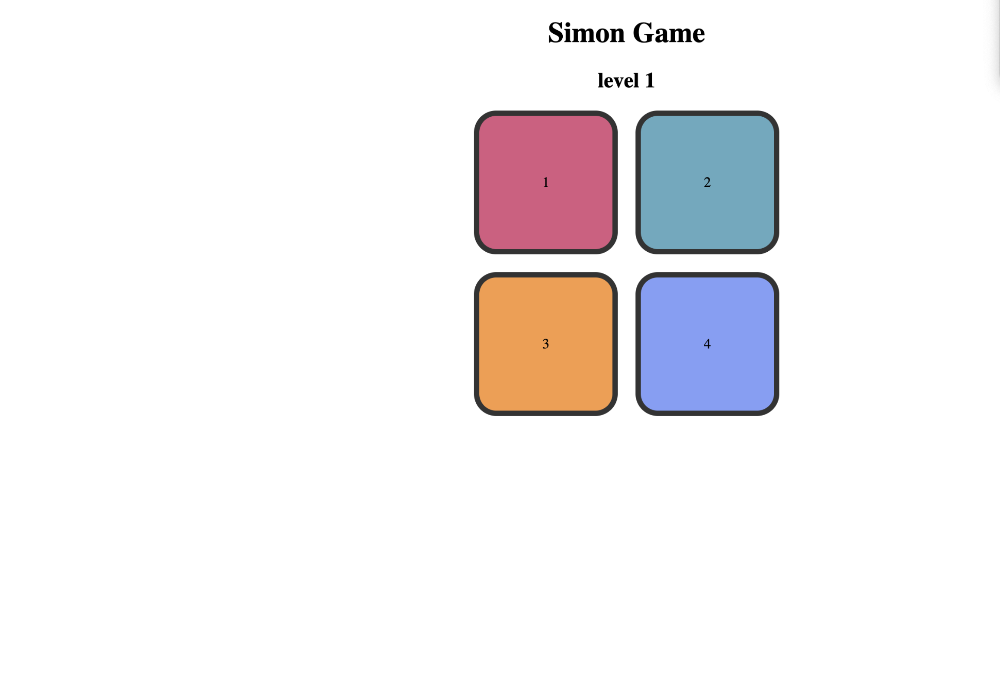
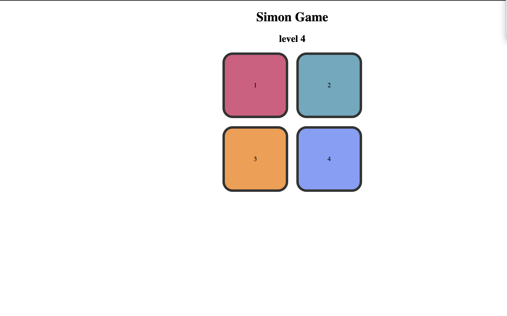
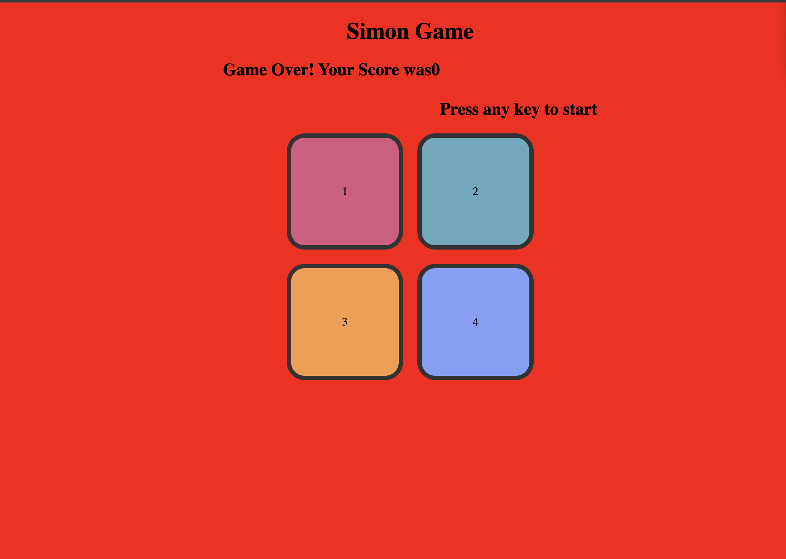

# 🟩🟥🟦🟧 Simon Game

> A fun and interactive Simon Game built using HTML, CSS, and JavaScript. Test your memory by repeating an ever-growing pattern of colors — one mistake and it’s game over!

---

## 🕹️ How to Play

1. Press any key to start the game.
2. A color will flash — memorize it!
3. Repeat the sequence by clicking the color buttons in order.
4. Each round adds a new color to the sequence.
5. If you press the wrong color, the game ends with a "Game Over" alert.
6. Press any key again to restart and try to beat your high score!

---

## 🔧 Tech Used

- **HTML5** – for the structure  
- **CSS3** – for styling the game interface  
- **JavaScript** – for game logic and interactivity

---

## 📸 Screenshot

Sure! Here's a clean breakdown of the **4 main stages of your Simon Game** (built with HTML, CSS, and JS):

---

### 🧠 **Simon Game Stages**

#### 1. **Start Stage**
- **What happens:** Game is idle, screen shows:  
  👉 *“Press any key to start the game”*
- **Trigger:** User presses any key on the keyboard.
- **Action:** Game moves to the next level (Level 1), and the first sequence is shown.

#### 2. **Game Play Stage**
- **What happens:**  
  - Game displays a sequence (by animating one or more color buttons).
  - Player tries to repeat the same sequence by clicking the buttons in order.
- **Feedback:**  
  - If player clicks correctly, the game adds one more color to the sequence and goes to the next level.
  - If wrong, it triggers the game over stage.

  

#### 3. **Game Over Stage**
- **What happens:**  
  - Wrong click? You hear a sound + screen flashes or changes color.
  - Title text changes to:  
    👉 *“Game Over, Press Any Key to Restart”*
- **All sequences reset.**

#### 4. **Restart Stage**
- **What happens:**  
  - Waits for the player to press any key again.
  - Game resets and starts fresh from Level 1.

  

---

## 🎯 Learning Purpose

This project was built to practice:
- JavaScript event handling
- Dynamic DOM updates
- Game state and restart logic
- CSS layout and color styling

---

## 🙋‍♂️ Contact

Made with ❤️ by **[ Kundan]**  
📧 [kg369033@gmail.com]  
🔗 GitHub: [Kundang25]